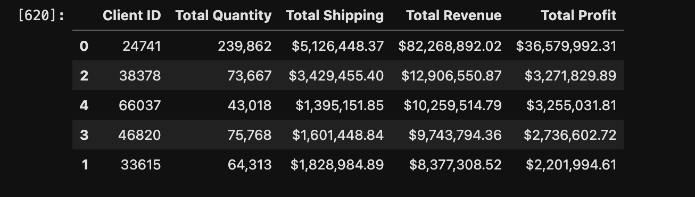

# pandas-challenge-1
Week 4 Challenge

# Functionality:
This dataframe ingests a csv file containing 54,639 order transactions. It futher identifies that top three categories of orders, the subcategory with the greatest number of orders, and the top five clients. In addition, the original file is augmented with shipping cost, total cost, total sales price with tax, and total profit. Finally, the top five clients and their corresponding contribution to items purchased, shipping paid, total price, and total profit are displayed professionally.

# Design:
1.) The first step was to review the raw data, ingest the file, and then explore that data within a dataframe to identify categories, subcategories, and clients. 2.) Next, the dataframe was transformed to produce various calculations to provide profitability insight into the most active clients. 3.) The next part of the design was to validate calculations against selected receipt data. 4.) The last step in the design was to summarize and analyze.

# Summary of Findings:
The data showed that the top five most active clients purchased 496,628 items, generated $123,556,060 in revenue, and contributed $48,045,451 to profit. A single client generated 48.3%, 66.6%, 76.1% and of those items respectively. There is significant concentration risk in the that one single client.

# Plagerism Statement:
No specific code was copied but the sources below were referenced for examples and syntax. 

# Sources:

Lutz, M. (2013). Learning python: Powerful object-oriented programming. " O'Reilly Media, Inc.".

Faculty, K.-S. C. (n.d.). Introduction to python. Introduction to Python. https://textbooks.cs.ksu.edu/intro-python/01-basic-python/index.html 
